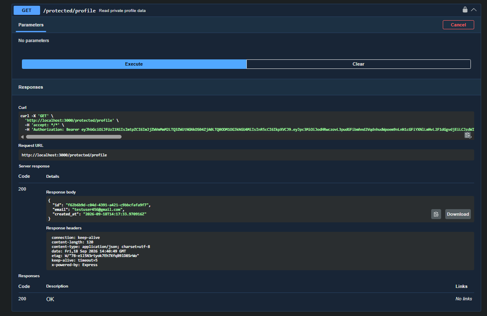

# Auth Practice API

A small Express + Supabase Auth API built to practice secure authentication:
sign up, log in, log out, and route protection with JSON Web Tokens (JWT).

Built as part of the FlyRank Backend AI Engineering track (Week 4, Assignment BE-03).

## What this project does

- Registers and authenticates users through Supabase Auth (no passwords or
  crypto handled manually)
- Issues and verifies JWTs on protected routes
- Uses a single reusable auth middleware for route protection
- Documents the API with Swagger UI, including bearer token authorization

## Setup

1. Clone the repo and install dependencies:

```bash
   npm install
```

2. Create a `.env` file in the root (see `.env.example` for the shape):

SUPABASE_URL=your_project_url
SUPABASE_KEY=your_anon_key
PORT=3000

Get these values from your own Supabase project under
Project Settings → API.

3. In your Supabase project, under Authentication → Sign In / Providers →
   Email, make sure email sign-ups are enabled. For quick local testing,
   you can also disable "Confirm email" so new accounts can log in
   immediately.

## Run it

```bash
node server.js
```

The server starts on `http://localhost:3000` and logs a confirmation that
it connected to Supabase.

## API reference

| Method | Route                  | Auth required | Purpose                                 |
| ------ | ---------------------- | ------------- | --------------------------------------- |
| POST   | `/auth/signup`         | No            | Create a new user account               |
| POST   | `/auth/login`          | No            | Authenticate and return a JWT           |
| POST   | `/auth/logout`         | Yes           | End the user's session                  |
| GET    | `/protected/profile`   | Yes           | Read the logged-in user's profile       |
| GET    | `/protected/dashboard` | Yes           | Second protected route, same middleware |
| GET    | `/public/info`         | No            | Open, unauthenticated data              |

Protected routes expect an `Authorization: Bearer <token>` header. A missing
or invalid token returns `401`.

## Swagger UI

Interactive API docs with a working "Authorize" lock are available at
`http://localhost:3000/docs`.


